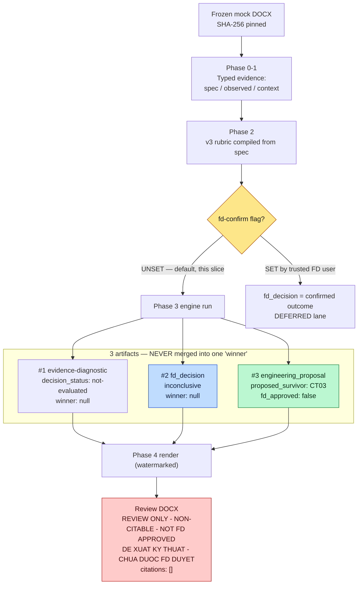

# Diagram: Luồng 3-artifact — CT03 hiện ra "sắc mà legit"

Sơ đồ cách plan `qbd-p221-formulation-selection` chỉ tên **CT03** mà **không**
giả vờ đã được FD duyệt. Chìa khóa: Phase 3 tách output thành **3 artifact riêng
biệt, không bao giờ gộp**.

---

## ASCII Version — toàn pipeline

```
  ┌──────────────────────────────────────────────────────────────────────┐
  │  PHASE 0 — Trích xuất hash-pinned (GO/NO-GO)                          │
  │  Frozen mock DOCX  ── khớp SHA-256 ──►  biên nhận từng ô công thức    │
  └───────────────────────────────┬──────────────────────────────────────┘
                                   ▼
  ┌──────────────────────────────────────────────────────────────────────┐
  │  PHASE 1 — Typed evidence (chặn lỗi F-001)                            │
  │  spec (yêu cầu)  ≠  observed (số đo)  ≠  composition context         │
  └───────────────────────────────┬──────────────────────────────────────┘
                                   ▼
  ┌──────────────────────────────────────────────────────────────────────┐
  │  PHASE 2 — Rubric v3 biên dịch từ spec  +  cờ fd-confirmed            │
  │  Cờ mặc định = TẮT (slice này)                                        │
  └───────────────────────────────┬──────────────────────────────────────┘
                                   ▼
                        ┌──────────────────────┐
                        │  Cờ fd-confirmed ?    │
                        └─────┬───────────┬─────┘
              TẮT (mặc định)  │           │  BẬT (FD user thật)
                              ▼           ▼
  ┌───────────────────────────────────┐  ┌─────────────────────────────────┐
  │ PHASE 3 — engine chạy (proposal)  │  │ fd_decision phản ánh kết quả    │
  │                                   │  │ đã được xác nhận  (lane hoãn)   │
  │  ┌─────────────────────────────┐  │  └─────────────────────────────────┘
  │  │ #1 evidence-diagnostic      │  │
  │  │    decision_status:         │  │
  │  │    not-evaluated            │  │
  │  ├─────────────────────────────┤  │   ◄── 3 Ô RIÊNG
  │  │ #2 fd_decision              │  │       KHÔNG BAO GIỜ GỘP
  │  │    inconclusive             │  │       thành 1 câu "winner"
  │  │    winner: null             │  │
  │  ├─────────────────────────────┤  │
  │  │ #3 engineering_proposal     │  │
  │  │    proposed_survivor: CT03  │  │
  │  │    fd_approved: false       │  │
  │  └─────────────────────────────┘  │
  └───────────────────┬───────────────┘
                      ▼
  ┌──────────────────────────────────────────────────────────────────────┐
  │  PHASE 4 — Render review DOCX (đóng dấu)                              │
  │  "REVIEW ONLY — NON-CITABLE — NOT FD APPROVED"                       │
  │  Khối: "ĐỀ XUẤT KỸ THUẬT — CHƯA ĐƯỢC FD DUYỆT"  → nêu tên CT03       │
  │  citations: []  (nguồn citable:false)                                 │
  └──────────────────────────────────────────────────────────────────────┘

  Legend:  ≠ = evidence khác loại, không được nhầm      TẮT = flag unset
```

---

## Mermaid Version — luồng quyết định



---

## Vì sao thiết kế này vừa "sắc" vừa "legit"

| Yêu cầu của bạn | Cơ chế trong sơ đồ |
|---|---|
| **Sắc** — file phải chỉ ra CT03 | Artifact #3 `engineering_proposal` nêu thẳng `proposed_survivor: CT03` |
| **Legit** — không giả vờ đã duyệt | `fd_approved: false` + `fd_decision` vẫn `inconclusive` + đóng dấu "NOT FD APPROVED" |
| **Chống lỗi F-001 cũ** | Phase 1 tách spec ≠ observed, không nhầm 90–110% thành số đo |
| **Không tự ý quyết** | Cờ `fd-confirmed` TẮT → máy không bao giờ tự nâng thành "winner" |
| **Ranh giới rõ** | 3 artifact là 3 object riêng; test Phase 5 cấm từ winner/decision lọt vào #3 |

**Điều tuyệt đối phải đúng (invariant):** ô #2 (`fd_decision`) và ô #3
(`engineering_proposal`) **không bao giờ** được gộp thành một câu "đã chọn CT03".
Đó là lằn ranh giữ file trung thực.
